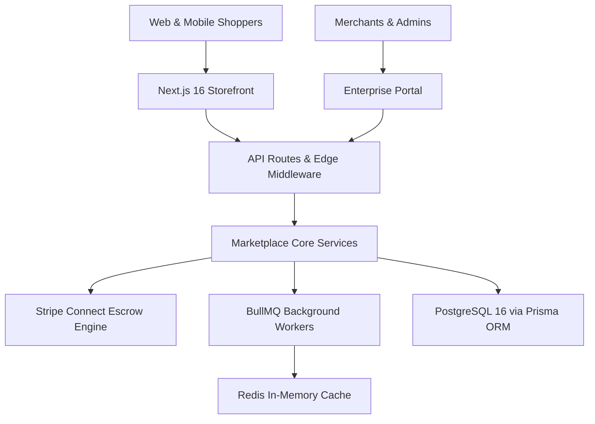
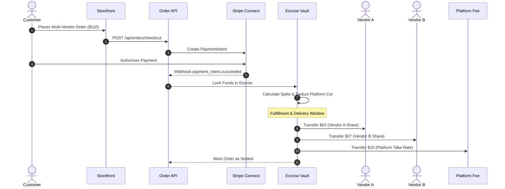

<div align="center">

# ⚡ NEXUS MULTI-VENDOR E-COMMERCE PLATFORM
### *High-Concurrency Marketplace Engine*

[](https://github.com/athil18/nexus-multi-vendor-ecommerce/stargazers)
[](https://github.com/athil18/nexus-multi-vendor-ecommerce/network/members)
[](https://nextjs.org/)
[](https://react.dev/)
[](https://tailwindcss.com/)
[](https://prisma.io/)
[](https://stripe.com/)
[](https://github.com/athil18/nexus-multi-vendor-ecommerce)
[](LICENSE)

<br />

> 🌟 **Star this repository if you find this architecture helpful for your next marketplace!** 🌟

<p align="center">
  <a href="#-overview">Overview</a> •
  <a href="#-key-capabilities">Capabilities</a> •
  <a href="#-system-architecture">Architecture</a> •
  <a href="#-escrow-payment-pipeline">Escrow Pipeline</a> •
  <a href="#-performance-benchmarks">Performance</a> •
  <a href="#-tech-stack">Tech Stack</a> •
  <a href="#-quick-start">Quick Start</a> •
  <a href="#-testing-suite">Testing</a>
</p>

---

</div>

## 💎 Overview

**Nexus** is an open-source, full-stack multi-vendor marketplace platform built for extreme concurrency, sub-second delivery, and automated merchant settlements.

Engineered with **Next.js 16 (App Router)**, **React 19**, **Tailwind CSS v4**, and **Prisma ORM**, Nexus unites a fast streaming storefront with a multi-tenant seller portal, admin moderation suite, automated **Stripe Connect Escrow Splits**, and background job processing via **BullMQ** and **Redis**.

---

## 🚀 Key Capabilities

| Capability | Legacy Marketplaces | Nexus Platform ⚡ |
|---|---|---|
| **Interactivity (TBT)** | 300 – 900 ms click latency | **0 ms Total Blocking Time** (Ultra-responsive) |
| **Visual Speed (LCP)** | 2.8 – 4.5s load time | **968 ms** (Sub-second Edge Streaming) |
| **Initial JS Payload** | 800 – 1,500 KiB monolithic bundle | **6.3 KiB** (Zero unused script execution) |
| **Vendor Settlement** | Manual month-end reconciliation | **Automated Multi-Vendor Stripe Escrow Splits** |
| **Modern Design** | Generic bootstrap templates | **Cinematic Glassmorphism**, fluid motion & dark mode |
| **Accessibility** | Inconsistent contrast & broken ARIA | **100/100 WCAG 2.1 AA** keyboard-navigable |
| **Background Jobs** | Blocking synchronous HTTP tasks | **Distributed BullMQ Queues** with Redis persistence |

---

## 📊 Performance Benchmarks

Nexus maintains near-perfect scores across Google Lighthouse audits:

```
┌────────────────────────────────────────────────────────────────────────┐
│                      GOOGLE LIGHTHOUSE 10.x AUDIT                      │
├──────────────────┬──────────────────┬──────────────────┬───────────────┤
│   PERFORMANCE    │  ACCESSIBILITY   │  BEST PRACTICES  │      SEO      │
│     98 / 100     │    100 / 100     │     96 / 100     │   100 / 100   │
└──────────────────┴──────────────────┴──────────────────┴───────────────┘
```

- ⚡ **Sub-Second LCP (968 ms)** – Instant initial paint powered by Next.js 16 Server Components
- 🛑 **0 ms Total Blocking Time (TBT)** – Zero thread-blocking scripts or hydration bottlenecks
- 🎯 **0.0047 CLS** – Layout-stable UI with strict dimensional containment
- ♿ **100/100 Accessibility** – High-contrast color tokens and comprehensive landmark navigation

---

## 🏗️ System Architecture



---

## 💸 Escrow Payment Pipeline

Nexus features an automated split payment workflow ensuring marketplace transparency, merchant trust, and dispute protection:



---

## 🛠️ Tech Stack

### Storefront & Client
- **Next.js 16.2.9** – App Router, Turbopack, Streaming Server Components, Metadata APIs
- **React 19.2.4** – Server Actions, `useOptimistic`, fine-grained hydration
- **Tailwind CSS v4** – Pure CSS variable theme tokens, GPU-accelerated utility primitives
- **Framer Motion 12** – Micro-interactions, layout transitions, and glassmorphic overlays
- **Zustand 5** – Zero-overhead client state container for shopping cart and user preferences

### Backend & Infrastructure
- **PostgreSQL 16** – Multi-tenant schema, ACID transactional integrity, compound indexes
- **Prisma ORM 7.9** – Type-safe database queries, schema migrations, zero-downtime evolution
- **Stripe Connect & Webhooks** – Custom merchant accounts, escrow holds, payout split routines
- **BullMQ 5.78 + Redis 7** – High-throughput background workers for email and webhook processing
- **AWS S3 SDK v3** – Presigned secure asset uploads and responsive image delivery
- **Sentry 10.58** – Distributed tracing, real-user monitoring, and error reporting

### Security & Standards
- **JWT & HTTP-Only Refresh Cookies** – 15-minute access tokens with auto-rotation
- **Zod 4.4 Runtime Contracts** – Strict ingress/egress validation across every API route
- **Role-Based Access Control (RBAC)** – Multi-tiered permissions (`admin`, `seller`, `customer`)
- **WCAG 2.1 AA & Section 508** – 4.5:1 minimum text contrast, ARIA dialog landmarks, keyboard skip links

---

## ⚡ Quick Start

### 1. Clone the Repository
```bash
git clone https://github.com/athil18/nexus-multi-vendor-ecommerce.git
cd nexus-multi-vendor-ecommerce
```

### 2. Configure Environment
```bash
cp .env.example .env
```
*(Configure `DATABASE_URL`, `JWT_SECRET`, and `STRIPE_SECRET_KEY` in `.env` with your local values)*

### 3. Install Dependencies
```bash
npm install
```

### 4. Setup Database & Seed Catalog
```bash
npm run db:generate
npm run db:migrate
npm run seed:run
```

### 5. Launch Development Server
```bash
npm run dev
```

Open [http://localhost:3000](http://localhost:3000) in your browser.

---

## 🧪 Testing Suite

Nexus includes a comprehensive test suite covering all layers:

```bash
# Unit & Component Tests
npm run test

# Backend Integration Tests (Database & API)
npm run test:backend

# End-to-End Playwright Tests (Full checkout & mobile viewports)
npm run test:e2e

# Production Build Verification
npm run build
```

---

## 📂 Project Structure

```
nexus-multi-vendor-ecommerce/
├── .github/                      # CI/CD Workflows & Automation
├── docs/                         # Architecture guides & benchmark reports
├── prisma/                       # PostgreSQL schema & migration history
├── public/                       # Static assets & product SVG illustrations
├── scripts/                      # Database backups, restore, and audits
├── seeds/                        # Realistic demo catalog & merchant seeders
├── src/                          # Application source code
│   ├── app/                      # Next.js App Router (Storefront, Portals, API)
│   ├── components/               # Modern UI components & Design tokens
│   ├── core/                     # Domain ports & clean architecture interfaces
│   ├── infrastructure/           # Prisma repositories & BullMQ queue provider
│   ├── lib/                      # Auth, Stripe, Redis, Rate limiting, Logger
│   ├── models/                   # Domain entities
│   ├── services/                 # Business logic (Order, Payment, Auth, Store)
│   └── store/                    # Zustand state management
├── test/                         # Unit, component & integration tests
├── e2e/                          # Playwright end-to-end test suite
├── .dockerignore
├── .env.example                  # Safe configuration template
├── .gitignore                    # Git ignore rules
├── docker-compose.yml            # Local PostgreSQL + Redis containers
├── eslint.config.mjs
├── LICENSE                       # MIT License
├── next.config.ts
├── package.json                  # Application dependencies & scripts
├── playwright.config.ts
├── postcss.config.mjs
├── README.md                     # Project documentation
├── tsconfig.json
└── vitest.config.ts
```

---

## 🤝 Contributing

Contributions are welcome! If you want to contribute:
1. **Fork** the repository.
2. Create a feature branch: `git checkout -b feature/amazing-feature`.
3. Commit your changes: `git commit -m "feat: add amazing feature"`.
4. Push to the branch: `git push origin feature/amazing-feature`.
5. Open a **Pull Request**.

---

## 🌟 Stargazers

If you find this repository valuable, please consider giving it a **Star ⭐**! It helps support ongoing open-source development.

<div align="center">
  <p><b>Maintained by <a href="https://github.com/athil18">Mohamed Aathil R</a></b></p>
  <p>Released under the <a href="LICENSE">MIT License</a>.</p>
</div>
