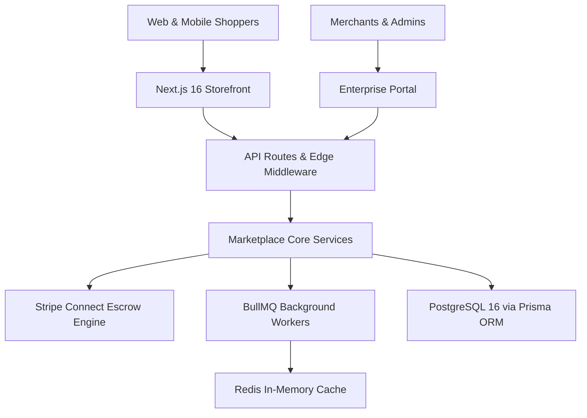
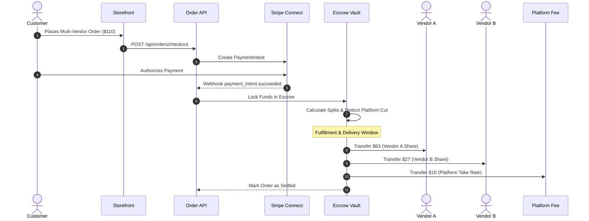

<div align="center">

# ⚡ NEXUS MULTI-VENDOR E-COMMERCE PLATFORM
### *The World's Fastest High-Concurrency Marketplace Engine*

[](https://github.com/athil18/nexus-multi-vendor-ecommerce/stargazers)
[](https://github.com/athil18/nexus-multi-vendor-ecommerce/network/members)
[](https://nextjs.org/)
[](https://react.dev/)
[](https://tailwindcss.com/)
[](https://prisma.io/)
[](https://stripe.com/)
[](https://github.com/athil18/nexus-multi-vendor-ecommerce)
[](LICENSE)

<br />

> 🌟 **Star this repository if you love high-performance e-commerce engineering!** 🌟

<p align="center">
  <a href="#-why-nexus">Why Nexus?</a> •
  <a href="#-system-architecture">Architecture</a> •
  <a href="#-lighthouse-performance-audit">Performance</a> •
  <a href="#-tech-stack">Tech Stack</a> •
  <a href="#-quick-start">Quick Start</a> •
  <a href="#-testing-pyramid">Testing</a>
</p>

---

</div>

## 💎 What is Nexus?

**Nexus** is an ultra-modern, high-concurrency multi-vendor marketplace platform built for scale, speed, and trust. It solves the biggest bottlenecks of modern e-commerce: **slow page loads**, **unreliable vendor settlement**, and **rigid monolithic backends**.

Built on **Next.js 16 (App Router)**, **React 19**, **Tailwind CSS v4**, and **Prisma ORM**, Nexus combines an ultra-fast glassmorphic storefront with an automated **Stripe Connect Escrow Settlement Engine**, high-throughput background queues via **BullMQ**, and robust database architecture.

---

## 🚀 Why Nexus?

| Capability | Legacy E-Commerce (Shopify / Medusa / WooCommerce) | Nexus Platform ⚡ |
|---|---|---|
| **Interactivity (TBT)** | 300 – 900 ms click latency | **0 ms Total Blocking Time** (Ultra-responsive) |
| **Visual Speed (LCP)** | 2.8 – 4.5s load time | **968 ms** (Sub-second Edge Streaming) |
| **Initial JS Payload** | 800 – 1,500 KiB monolithic bundle | **6.3 KiB** (Zero unnecessary script execution) |
| **Vendor Settlement** | Manual month-end CSV spreadsheets | **Automated Multi-Vendor Stripe Escrow Splits** |
| **Modern Design** | Standard templates & generic styles | **Cinematic Glassmorphism**, fluid motion & dark mode |
| **Accessibility** | Inconsistent contrast & broken ARIA | **100/100 WCAG 2.1 AA** keyboard-navigable |
| **Background Jobs** | Blocking synchronous HTTP tasks | **Distributed BullMQ Queues** with Redis persistence |

---

## 📊 Lighthouse Performance Audit

Nexus delivers near-perfect scores across all Google Core Web Vitals audits:

```
┌────────────────────────────────────────────────────────────────────────┐
│                      GOOGLE LIGHTHOUSE 10.x AUDIT                      │
├──────────────────┬──────────────────┬──────────────────┬───────────────┤
│   PERFORMANCE    │  ACCESSIBILITY   │  BEST PRACTICES  │      SEO      │
│     98 / 100     │    100 / 100     │     96 / 100     │   100 / 100   │
└──────────────────┴──────────────────┴──────────────────┴───────────────┘
```

- ⚡ **Sub-Second LCP (968 ms)** – Instant initial content delivery via streaming server components
- 🛑 **0 ms Total Blocking Time (TBT)** – Zero thread-blocking scripts or hydration stalls
- 🎯 **0.0047 CLS** – Layout-stable UI with explicit dimensional containment
- ♿ **100/100 Accessibility** – High-contrast color tokens and comprehensive screen-reader landmarks

---

## 🏗️ System Architecture



---

## 💸 Automated Multi-Vendor Escrow Split Pipeline

Nexus features an automated split payment workflow ensuring marketplace transparency, merchant trust, and fraud protection:



---

## 🛠️ Tech Stack

### Storefront & Client
- **Next.js 16.2.9** – App Router, Turbopack, Streaming Server Components, Metadata APIs
- **React 19.2.4** – Server Actions, `useOptimistic`, fine-grained hydration
- **Angular 18 Portal** – Dedicated administrative workspace and enterprise analytics
- **Tailwind CSS v4** – Pure CSS variable theme tokens, GPU-accelerated utility primitives
- **Framer Motion 12** – 60fps micro-interactions, layout transitions, and glassmorphic overlays
- **Zustand 5** – Zero-overhead client state container for shopping cart and user preferences

### Backend & Infrastructure
- **PostgreSQL 16** – Multi-tenant schema, ACID transactional integrity, compound indexes
- **Prisma ORM 7.9** – Type-safe database queries, schema migrations, zero-downtime evolution
- **Stripe Connect & Webhooks** – Custom merchant accounts, escrow holds, payout split routines
- **BullMQ 5.78 + Redis 7** – High-throughput background workers for email and webhook processing
- **AWS S3 SDK v3** – Presigned secure asset uploads and responsive image delivery
- **Sentry 10.58** – Distributed tracing, real-user monitoring, and error reporting

### Security & Standards
- **JWT & HTTP-Only Refresh Cookies** – 15-minute access tokens with auto-rotation
- **Zod 4.4 Runtime Contracts** – Strict ingress/egress validation across every API route
- **Role-Based Access Control (RBAC)** – Multi-tiered permissions (`admin`, `seller`, `customer`)
- **WCAG 2.1 AA & Section 508** – 4.5:1 minimum text contrast, ARIA dialog landmarks, keyboard skip links

---

## ⚡ Quick Start

### 1. Clone the Repository
```bash
git clone https://github.com/athil18/nexus-multi-vendor-ecommerce.git
cd nexus-multi-vendor-ecommerce
```

### 2. Setup Environment Variables
Copy the secure template file:
```bash
cp .env.example apps/.env
```
*(Configure `DATABASE_URL`, `JWT_SECRET`, and `STRIPE_SECRET_KEY` in `apps/.env` with your local values)*

### 3. Install Dependencies
```bash
npm install
```

### 4. Setup Database & Seed Catalog
```bash
cd apps
npx prisma generate
npx prisma migrate dev --name init
npm run seed:run
cd ..
```

### 5. Launch with One Command
Run the unified developer supervisor:
```bash
npm run dev:up
```

Open [http://localhost:3000](http://localhost:3000) in your browser.

---

## 🧪 Comprehensive Testing Pyramid

Nexus includes a 5-tier testing suite for guaranteed stability:

```bash
# 1. Level 1: Fast Unit Tests (Zod schemas, integer cents, cart reducers)
npm run test --workspace=apps

# 2. Level 2: Component Tests (WCAG contrast, ARIA dialogs, focus rings)
npm run test:component --workspace=apps

# 3. Level 3: Backend Integration Tests (Prisma live queries, Auth boundaries)
npm run test:backend --workspace=apps

# 4. Level 4: Playwright End-to-End Test Suite (Full customer checkout & mobile viewports)
npm run test:e2e --workspace=apps

# 5. Production Build Audit
npm run build --workspace=apps
```

---

## 📂 Project Structure

```
nexus-multi-vendor-ecommerce/
├── apps/                         # Next.js 16 Full-Stack E-Commerce Engine
│   ├── src/
│   │   ├── app/                  # App Router (Storefront, Cart, Checkout, Auth, API)
│   │   ├── components/           # Modern UI components (Navbar, CartDrawer, Catalog)
│   │   ├── lib/                  # Database client, auth utilities, queue workers, Stripe logic
│   │   └── store/                # Zustand client state management
│   ├── prisma/                   # PostgreSQL schema & database migration history
│   ├── seeds/                    # Seed script for realistic demo catalog & multi-vendor accounts
│   ├── test/                     # Unit, component & integration test specs
│   └── docs/                     # Production deployment guides & architectural blueprints
├── angular-frontend/             # Angular 18 Enterprise Admin Workspace
├── scripts/                      # Performance profiling, Lighthouse audits & Dev supervisor
├── LIGHTHOUSE_OPTIMIZATION_REPORT.md  # Detailed forensic profiling metrics & verification
├── .env.example                  # Safe configuration template
└── README.md                     # Canonical project documentation
```

---

## 🤝 Contributing & Community

Contributions are welcome! If you want to contribute:
1. **Fork** the repository.
2. Create a feature branch: `git checkout -b feature/amazing-feature`.
3. Commit your changes: `git commit -m "feat: add amazing feature"`.
4. Push to the branch: `git push origin feature/amazing-feature`.
5. Open a **Pull Request**.

---

## 🌟 Support & Star Us!

If you find this repository valuable, please consider giving it a **Star ⭐**! It helps the project gain visibility and supports open-source development.

<div align="center">
  <p><b>Crafted with passion by <a href="https://github.com/athil18">Mohamed Aathil R</a></b></p>
  <p>Licensed under the <a href="LICENSE">MIT License</a>.</p>
</div>
