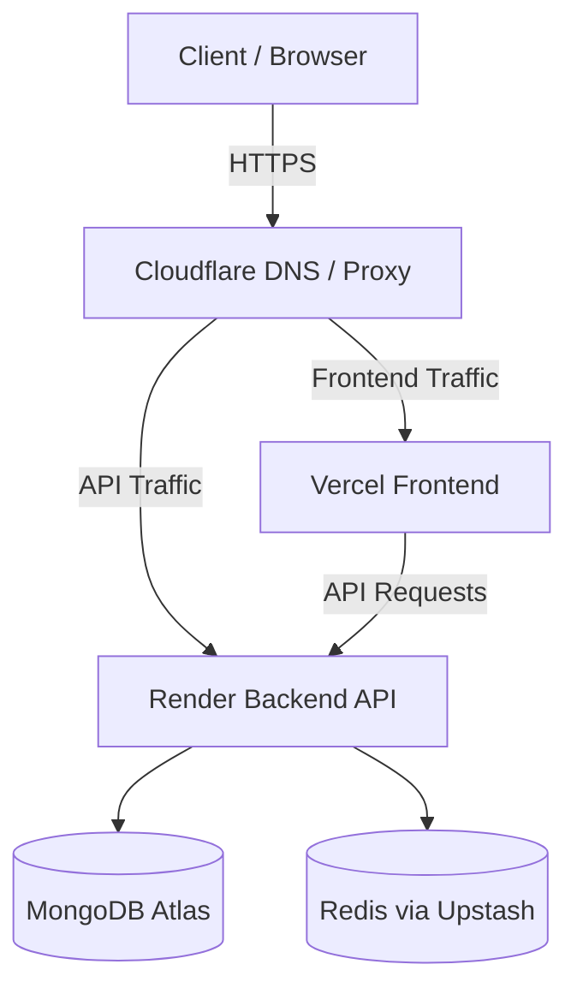

# Deployment and CI/CD Plan

## 1. Infrastructure Diagram

## 2. Environment Variables & Environments

We have configured three primary environments: **Development**, **Staging**, and **Production**.

**Development:**
- Next.js URL: `https://dev.marketplace.com`
- Backend API: `https://api-dev.marketplace.com`
- Database: MongoDB Atlas (Dev Cluster)

**Staging:**
- Next.js URL: `https://staging.marketplace.com`
- Backend API: `https://api-staging.marketplace.com`
- Database: MongoDB Atlas (Staging Cluster)

**Production:**
- Next.js URL: `https://www.marketplace.com`
- Backend API: `https://api.marketplace.com`
- Database: MongoDB Atlas (Production Cluster)

## 3. Secrets Inventory

The following secrets are required and must be injected via GitHub Secrets and the respective hosting providers (Vercel/Render):

| Secret Name | Purpose | Location Managed |
|-------------|---------|------------------|
| `MONGO_URI` | Database connection string | GitHub, Render |
| `JWT_SECRET` | Auth Token generation | Render |
| `JWT_REFRESH_SECRET` | Refresh Token generation | Render |
| `STRIPE_SECRET_KEY` | Stripe Payments processing | Render |
| `STRIPE_WEBHOOK_SECRET`| Stripe webhooks validation | Render |
| `VERCEL_TOKEN` | CI/CD deployment | GitHub |
| `RENDER_DEPLOY_HOOK_PROD` | Auto-deploy for backend prod | GitHub |

*Note: Secrets are never hardcoded. They are managed via GitHub Environments to prevent repository exposure.*

## 4. Deployment Workflow (CI/CD)

### Continuous Integration (CI)
On every pull request to `main`, `staging`, or `dev`:
1. **Type Checking:** Validates TypeScript interfaces.
2. **Linting:** Runs ESLint.
3. **Unit Tests:** Runs Vitest on isolated components.
4. **Integration & Smoke Tests:** Validates core workflows.
5. **Docker Build Check:** Verifies container image build capability for both frontend and backend.

### Continuous Deployment (CD)
On merge to `main`, `staging`, or `dev`:
1. **Database Safety:** Validates schema migrations and executes `migrate-mongo up` on the appropriate cluster.
2. **Frontend Deployment:** Builds and pushes to Vercel.
3. **Backend Deployment:** Triggers Render deployment webhooks.
4. **Observability:** Logs deployment events for monitoring.

## 5. Domain & HTTPS Setup

- **Domain Management:** Managed via Cloudflare or Vercel.
- **HTTPS Enforcement:** Vercel provides automatic SSL for the frontend. Render provides automatic SSL for the backend API.
- **Traffic Routing:** Subdomains (`api.*`) route explicitly to backend services. Both services strictly enforce `Strict-Transport-Security` (HSTS).

## 6. Rollback Process

### Application Rollback
- **Frontend (Vercel):** Use Vercel's instant rollback feature via the dashboard or Vercel CLI (`vercel rollback`).
- **Backend (Render):** Deploy a previous, known-good commit from the Render dashboard.

### Database Rollback
- **Schema Rollback:** Revert DB changes via `npm run migrate:down` triggered via GitHub Actions manually.
- **Data Rollback:** Point-in-time recovery using MongoDB Atlas automated backups.

## 7. Recovery Process (Disaster Recovery)
1. **Incident Declaration:** Acknowledge outage via DataDog/Sentry alerts.
2. **Service Restoration:** If a hosting provider goes down, we have Dockerfiles for both frontend and backend. Services can be migrated to AWS ECS or Fly.io rapidly.
3. **Database Restoration:** MongoDB Atlas multi-region backups ensure no data loss. In event of cluster failure, failover is automatic or can be manually triggered via Atlas Dashboard.
