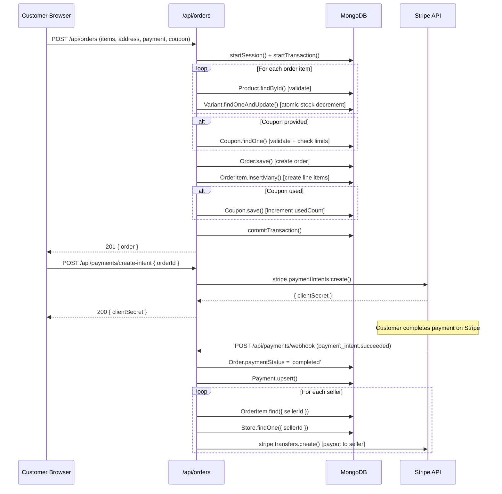

# Architecture Deep Dive — Nexus Marketplace

> Version: 1.0.0 | Last Updated: 2026-06-14

---

## System Context

Nexus is a monolithic Next.js 16 application that serves as both the frontend (React CSR pages) and backend (API routes). It connects to MongoDB Atlas for persistence, Stripe for payments, and uses JWT for stateless authentication.

## Component Diagram

```
┌─────────────────────── Next.js 16 Application ────────────────────────┐
│                                                                       │
│  ┌── Frontend Layer ──────────────────────────────────────────────┐   │
│  │                                                                │   │
│  │  AppProvider (React Context)                                   │   │
│  │  ├── user: UserSession | null                                  │   │
│  │  ├── token: string | null                                     │   │
│  │  ├── cart: CartItem[]                                         │   │
│  │  └── theme: 'light' | 'dark'                                 │   │
│  │                                                                │   │
│  │  Pages (all 'use client')                                     │   │
│  │  ├── / (Home: catalog, hero, filters)                         │   │
│  │  ├── /auth/login, /auth/register                              │   │
│  │  ├── /checkout (shipping + payment form)                      │   │
│  │  ├── /seller (dashboard + store setup)                        │   │
│  │  ├── /customer (order history)                                │   │
│  │  └── /admin (moderation queue)                                │   │
│  │                                                                │   │
│  │  Components                                                    │   │
│  │  └── Navbar (nav, search, cart, auth, theme toggle)           │   │
│  │                                                                │   │
│  └────────────────────────────────────────────────────────────────┘   │
│                               ↕ fetch('/api/*')                       │
│  ┌── Backend Layer (API Routes) ──────────────────────────────────┐   │
│  │                                                                │   │
│  │  Middleware Utilities                                          │   │
│  │  ├── lib/db.ts (MongoDB singleton connection)                 │   │
│  │  ├── lib/auth.ts (getAuthUser, authorizeRole)                 │   │
│  │  ├── lib/jwt.ts (generate/verify access/refresh tokens)       │   │
│  │  ├── lib/stripe.ts (Stripe client)                            │   │
│  │  └── lib/pagination.ts (parsePagination)                      │   │
│  │                                                                │   │
│  │  Route Groups                                                  │   │
│  │  ├── /api/auth/* (7 routes)                                   │   │
│  │  ├── /api/products/* (3 routes)                               │   │
│  │  ├── /api/orders/* (2 routes)                                 │   │
│  │  ├── /api/categories (1 route)                                │   │
│  │  ├── /api/seller/* (6 routes)                                 │   │
│  │  ├── /api/admin/* (2 routes)                                  │   │
│  │  └── /api/payments/* (4 routes)                               │   │
│  │                                                                │   │
│  │  Models (Mongoose Schemas)                                     │   │
│  │  └── 14 entities (see schema.md)                              │   │
│  │                                                                │   │
│  └────────────────────────────────────────────────────────────────┘   │
│                                                                       │
└───────────────────────────────────────────────────────────────────────┘
         │                    │                    │
         ▼                    ▼                    ▼
    MongoDB Atlas         Stripe API         Client Browser
    (14 collections)      (Connect/Transfer)   (localStorage)
```

## Data Flow: Order Creation



## Security Architecture

```
┌─ Authentication Flow ──────────────────────────────────────────┐
│                                                                │
│  Login → bcrypt.compare() → JWT signed (HS256)                │
│                                                                │
│  Access Token (15min)                                         │
│  ├── Stored: Client memory (React state)                      │
│  ├── Transmitted: Authorization header                        │
│  └── Verified: lib/jwt.ts → verifyAccessToken()               │
│                                                                │
│  Refresh Token (7 days)                                       │
│  ├── Stored: httpOnly cookie (browser) + SHA-256 hash (DB)    │
│  ├── Transmitted: Cookie (automatic)                          │
│  └── Rotated: Old hash removed, new hash stored               │
│                                                                │
│  Request Pipeline:                                             │
│  req → getAuthUser() → verifyAccessToken()                    │
│       → User.findById().select('status')                      │
│       → if (suspended) → null → 401                           │
│       → return { id, role }                                   │
│       → authorizeRole(user, allowedRoles)                     │
│       → if (!allowed) → 403                                   │
│                                                                │
└────────────────────────────────────────────────────────────────┘
```

## Financial Architecture

```
Order Total Calculation:
────────────────────────
For each line item:
  lineTotal = variant.price × quantity

If coupon applies:
  totalDiscount = min(couponValue, eligibleSubtotal, maxDiscount)
  Each item gets prorated: discount × (lineTotal / eligibleSubtotal)

Per item:
  platformFee  = lineTotal × 0.10 (10% platform cut)
  sellerPayout = lineTotal − discountApplied − platformFee
  taxAmount    = 0 (reserved for future)

Invariant:
  sum(platformFee + sellerPayout + discountApplied + taxAmount) = orderTotal

Payout:
  On payment_intent.succeeded → for each seller:
    totalSellerPayout = sum(orderItems.sellerPayout where sellerId matches)
    stripe.transfers.create({ amount, destination: connectedAccountId })
```

---

> **Cross-references**: [techspec.md](techspec.md) (system overview), [schema.md](schema.md) (data model), [ADR.md](ADR.md) (decisions)
