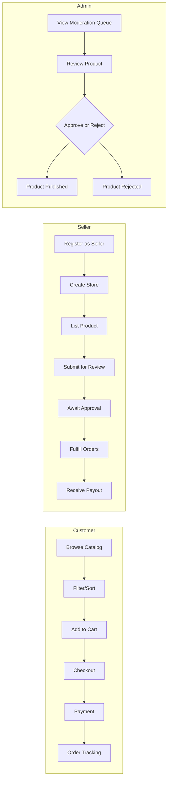
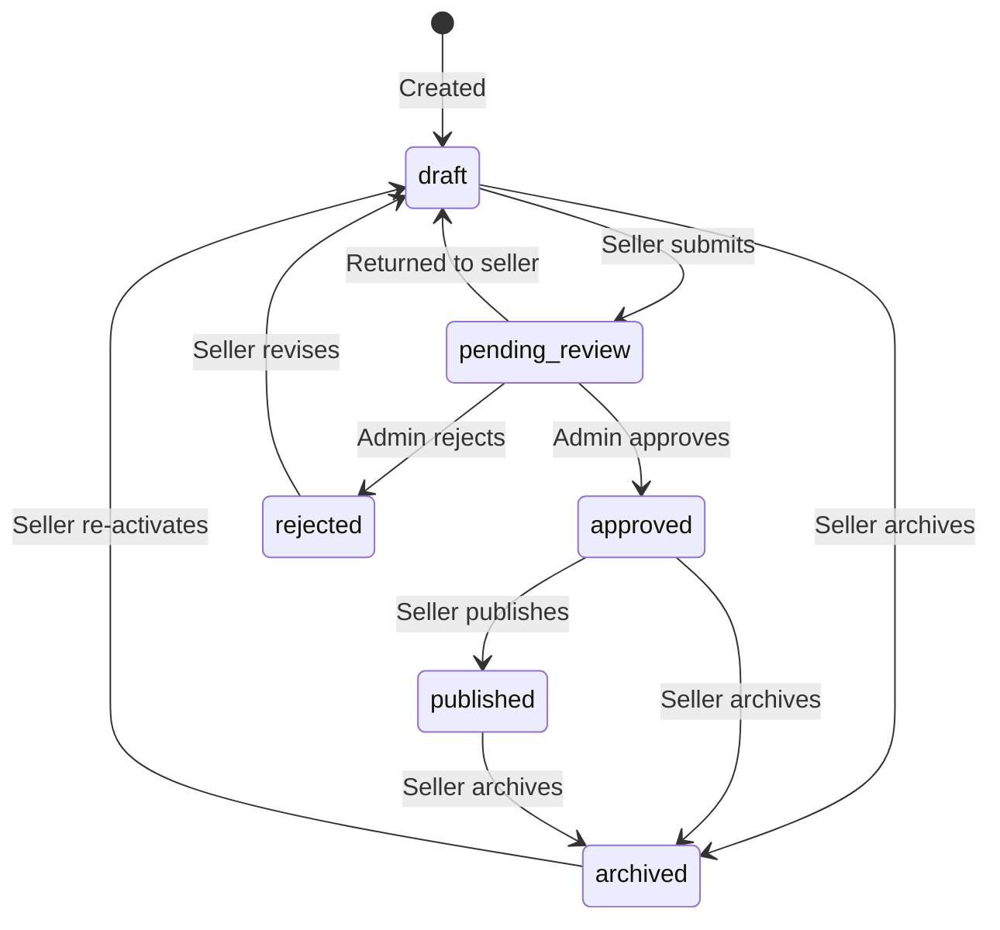
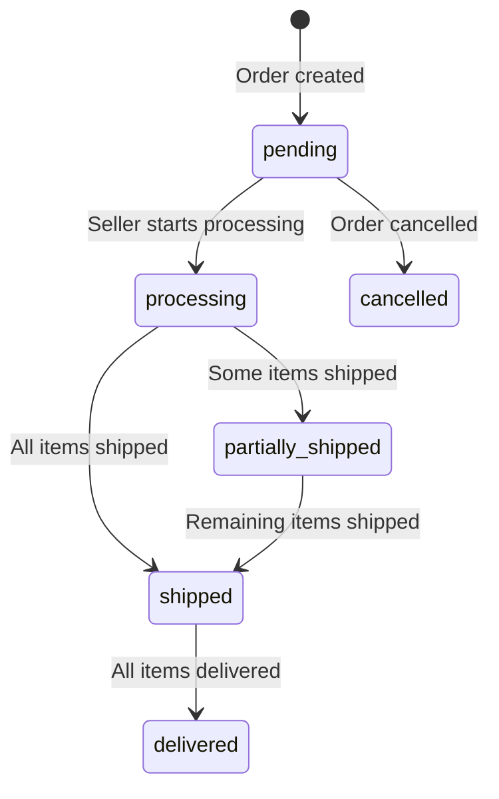
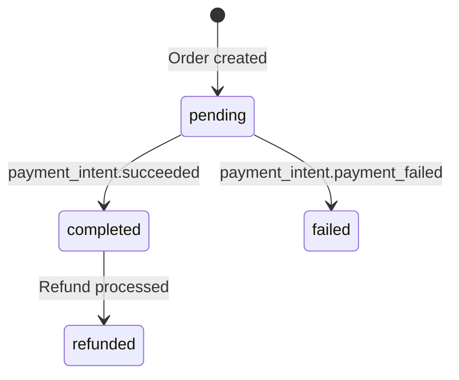

# Application Flow — Nexus Marketplace

> Version: 1.0.0 | Last Updated: 2026-06-14

---

## User Journeys

### Journey Map Overview



---

## Happy Paths

### Customer Happy Path: Browse → Purchase → Track

1. **Land on home page** (`/`) — Hero banner + product catalog renders with mock fallback products
2. **Products load from API** — `GET /api/products` returns published products; replaces mocks if data exists
3. **Browse and filter** — Customer selects category tab, adjusts price slider, toggles "In Stock Only"
4. **Add to cart** — Click "Add to Cart" → `addToCart()` in AppContext → localStorage persisted → toast success
5. **Navigate to checkout** — Click cart icon in Navbar → `/checkout` page loads with cart summary
6. **Enter shipping details** — Fill name, address, city, zip, country
7. **Enter payment details** — Fill card number, expiry, CVC (mock/Stripe Elements)
8. **Place order** — `POST /api/orders` (transactional) → `POST /api/payments/create-intent` → Stripe Payment Intent created
9. **Payment confirmed** — Webhook `payment_intent.succeeded` → Order status updated → Seller payouts triggered
10. **Redirect to customer dashboard** — `/customer` page shows order history with status

### Seller Happy Path: Onboard → List → Fulfill → Earn

1. **Register** — `POST /api/auth/register` with `role: 'seller'`
2. **Login** — `POST /api/auth/login` → Access + refresh tokens issued
3. **Navigate to seller dashboard** — `/seller` page loads → No store detected
4. **Create store** — Fill store name, description, logo URL → `POST /api/seller/store`
5. **Create product** — `POST /api/products` with product details → Status: `draft`
6. **Submit for review** — `PATCH /api/seller/products/:id/status` → Status: `pending_review`
7. **Admin approves** — Status transitions to `approved` → Seller publishes to `published`
8. **Customer orders product** — Order created, OrderItem assigned to seller
9. **Fulfill order** — `PUT /api/seller/orders/:id/status` → `processing` → `shipped` → `delivered`
10. **Connect Stripe** — `POST /api/payments/onboarding` → Stripe Express onboarding link
11. **Receive payout** — Webhook triggers Stripe Transfer to seller's connected account

### Admin Happy Path: Moderate → Maintain Quality

1. **Login as admin** — `POST /api/auth/login` (role: admin)
2. **Navigate to admin dashboard** — `/admin` page loads
3. **View review queue** — `GET /api/admin/products?status=pending_review`
4. **Review product details** — See name, description, price, seller info
5. **Approve or reject** — `PATCH /api/admin/products/:id/status` → `published` or `rejected`
6. **Filter and search** — Switch tabs (Review Queue / Approved / Rejected), search by keyword

---

## Edge Cases

### Authentication Edge Cases
| Scenario | Behavior |
|----------|----------|
| Expired access token | `verifyAccessToken()` throws → `getAuthUser()` returns `null` → 401 response |
| Expired refresh token | `POST /api/auth/refresh` fails → User must re-login |
| Suspended user with valid token | `getAuthUser()` checks `user.status === 'suspended'` → returns `null` → 401 |
| Invalid refresh token cookie | Hash comparison fails → 401, old token removed from DB |
| Multiple concurrent refresh requests | Each generates new tokens; old hashed tokens accumulate (bounded by array) |

### Cart Edge Cases
| Scenario | Behavior |
|----------|----------|
| Product removed from DB after adding to cart | `POST /api/orders` fails with "Product not found" → 400 error → toast |
| Product goes out of stock after adding to cart | Variant `$gte` guard fails → "Insufficient stock" error → transaction aborted |
| Duplicate product added | Quantity is incremented, not duplicated (AppContext merge logic) |
| Cart persists after logout | `clearCart()` is called in `logoutUser()` → cart cleared |
| Cart on page refresh | Loaded from `localStorage` in `useEffect` on mount |

### Order Edge Cases
| Scenario | Behavior |
|----------|----------|
| Payment fails after order created | Webhook triggers `payment_intent.payment_failed` → `paymentStatus: 'failed'` → stock restored |
| Coupon already at usage limit | Transaction throws "Coupon usage limit reached" → aborted |
| Coupon expired | Date check fails → "Coupon is expired or not active" → aborted |
| Order total below coupon minimum | "Minimum eligible amount" error → aborted |
| Multi-seller order | `sellerIds[]` populated; each seller gets separate `OrderItem` entries and separate Stripe Transfers |
| Seller not Stripe-connected | Transfer skipped with console warning; payout queued implicitly |

### Product Edge Cases
| Scenario | Behavior |
|----------|----------|
| Invalid status transition | `PRODUCT_STATUS_TRANSITIONS` map checked; invalid transitions rejected |
| Product with no variants | `basePrice` used directly; no stock decrement (controlled by `inStock` flag) |
| Duplicate product slug | `Date.now()` appended to slug to ensure uniqueness |
| Product deleted while in order | OrderItem references `productId`; display shows "Deleted Product" |

---

## Customer Flows

### Registration Flow
```
[Register Page] → POST /api/auth/register
    ├─ Validation (Zod: name≥2, email, password≥8)
    ├─ Check email uniqueness
    ├─ Hash password (bcrypt)
    ├─ Create User (role: customer, status: active)
    ├─ Generate access + refresh tokens
    ├─ Set refreshToken httpOnly cookie
    └─ Return { accessToken, user }
```

### Cart Flow
```
[Browse Products] → addToCart(item)
    ├─ Check if item exists in cart (productId + variantId)
    │   ├─ YES → Increment quantity
    │   └─ NO → Append to cart array
    ├─ Persist to localStorage
    └─ Show toast notification
```

### Checkout Flow
```
[Checkout Page] → Submit Form
    ├─ Validate shipping fields (name, address, city, zip)
    ├─ Validate payment fields (card, expiry, CVC)
    ├─ POST /api/orders (with orderItems, shippingAddressId, paymentMethod)
    │   ├─ Start MongoDB session
    │   ├─ Validate coupon (if provided)
    │   ├─ For each item:
    │   │   ├─ Validate product exists
    │   │   ├─ Atomic stock decrement (if variant)
    │   │   └─ Calculate line total
    │   ├─ Calculate platform fee (10%) and seller payout per item
    │   ├─ Create Order document
    │   ├─ Insert OrderItem documents
    │   ├─ Update coupon usage
    │   └─ Commit transaction
    ├─ POST /api/payments/create-intent (with orderId)
    │   ├─ Create Stripe PaymentIntent
    │   └─ Return clientSecret
    └─ Redirect to /customer (after payment simulation)
```

---

## Seller Flows

### Store Creation Flow
```
[Seller Dashboard (/seller)] → No store detected
    ├─ Render store creation form
    ├─ POST /api/seller/store { storeName, description, logo }
    │   ├─ Auth check (must be seller role)
    │   ├─ Uniqueness check (one store per seller)
    │   └─ Create Store document
    └─ Reload dashboard with store data
```

### Order Fulfillment Flow
```
[Seller Orders Table] → Select new status from dropdown
    ├─ PUT /api/seller/orders/:itemId/status { status }
    │   ├─ Auth + ownership check
    │   ├─ Validate status is in allowed list
    │   ├─ Update OrderItem.status
    │   ├─ Recalculate Order.aggregateStatus
    │   │   ├─ All items same status → that status
    │   │   ├─ Mix of shipped/delivered → partially_shipped
    │   │   └─ Any processing → processing
    │   └─ Return updated OrderItem
    └─ Refresh dashboard metrics
```

---

## Admin Flows

### Product Moderation Flow
```
[Admin Dashboard (/admin)] → Load pending products
    ├─ GET /api/admin/products?status=pending_review
    ├─ Display table with product details and seller info
    ├─ Click Approve → PATCH /api/admin/products/:id/status { status: 'published' }
    │   ├─ Status transition: pending_review → approved → published
    │   └─ Product becomes visible on storefront
    └─ Click Reject → PATCH /api/admin/products/:id/status { status: 'rejected' }
        ├─ Status transition: pending_review → rejected
        └─ Seller must revise and re-submit (rejected → draft → pending_review)
```

---

## State Transitions

### Product Status Lifecycle


### Order Aggregate Status Lifecycle


### Payment Status Lifecycle


---

## Error Recovery Flows

### Payment Failure Recovery
```
Webhook: payment_intent.payment_failed
    ├─ Find Order by metadata.orderId
    ├─ Set Order.paymentStatus = 'failed'
    ├─ Find all OrderItems for this order
    ├─ For each item with variantId:
    │   └─ Restore stock: Variant.$inc({ stock: +quantity })
    └─ Customer sees "Payment Failed" status in order history
```

### Transaction Abort Recovery
```
POST /api/orders (any validation failure)
    ├─ session.abortTransaction()
    ├─ All changes rolled back:
    │   ├─ Stock decrements reversed
    │   ├─ Order document not created
    │   ├─ OrderItems not created
    │   └─ Coupon usage not incremented
    └─ Return 400 with error message
```

### Auth Token Refresh Recovery
```
Access token expired → API returns 401
    ├─ Client calls POST /api/auth/refresh (with httpOnly cookie)
    │   ├─ Verify refresh token
    │   ├─ Remove old hashed token from DB
    │   ├─ Issue new access + refresh tokens
    │   └─ Return { accessToken }
    └─ Retry original request with new token
```

---

> **Cross-references**: [prd.md](prd.md) (requirements), [schema.md](schema.md) (data model), [techspec.md](techspec.md) (architecture)
