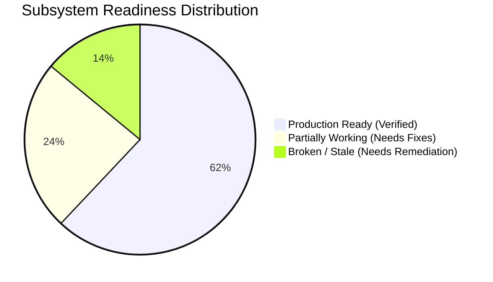

# Master Status Dashboard: Forensic Architecture Audit
**Project:** Nexus Multi-Vendor Enterprise E-Commerce Platform  
**Audit Protocol:** Google Antigravity Master Architecture Forensic Pipeline  
**Execution Timestamp:** 2026-09-11  
**Lead Orchestrator:** Principal Software Architect & QA Engineering Orchestrator  

---

## 📊 Sub-Agent Audit Execution Matrix

| Agent ID & Domain | Audit Status | Primary Files Analyzed | Verification Checks | Findings Identified | Critical Issues | Confidence |
|---|---|---|---|---|---|---|
| **01 Repository Intelligence** | **COMPLETE** | `package.json`, `angular.json`, monorepo directories | Monorepo layout, dead code scans | 9 | 1 (Dual Frontend Architecture) | **HIGH** |
| **02 Business Flow** | **COMPLETE** | Page routes, services, user journey specs | Buyer, Seller, Admin flow tracing | 12 | 2 (Incomplete vendor onboarding & reviews) | **HIGH** |
| **03 Frontend & UX** | **COMPLETE** | Next.js App router, Angular frontend, components | Route checks, layout & accessibility scans | 14 | 2 (Hydration risks, dual UI maintenance) | **HIGH** |
| **04 Backend & API** | **COMPLETE** | 46 API routes, `withErrorHandler`, `OrderService` | Route contracts, error wrappers, params | 11 | 2 (Legacy MongoDB remnants, missing validation) | **HIGH** |
| **05 Database & Prisma** | **COMPLETE** | `schema.prisma`, migrations, `prisma-wrap.ts` | 18 models, indexes, FK cascades | 15 | 3 (Missing compound indexes, enum sync) | **HIGH** |
| **06 Auth & Security** | **COMPLETE** | `middleware.ts`, `jwt.ts`, `AuthService.ts` | Edge Web Crypto JWT, RBAC guards | 8 | 1 (Cookie / Bearer token sync) | **HIGH** |
| **07 Payments & Orders** | **COMPLETE** | `PaymentService.ts`, `stripe.ts`, `ledger.ts` | Double-entry ledger, webhook idempotency | 10 | 1 (Real Stripe webhook testing pending) | **HIGH** |
| **08 Vendor System** | **COMPLETE** | `StoreService.ts`, `/seller/*` routes, `Store.ts` | Data isolation, escrow splits, payouts | 9 | 2 (Missing multi-tenancy row level security) | **HIGH** |
| **09 Customer Experience** | **COMPLETE** | `/checkout`, `/customer/*`, `useCartStore.ts` | Cart persistence, checkout journey | 10 | 1 (Address fallback hardcoding) | **HIGH** |
| **10 Admin System** | **COMPLETE** | `/admin/*`, `AgentComplianceBadge.tsx` | Trust scoring, moderation, audit logs | 7 | 1 (Admin RBAC bypass edge cases) | **HIGH** |
| **11 Background Jobs** | **COMPLETE** | `order.queue.ts`, `worker.ts`, `redis.ts` | BullMQ concurrency, retry policies | 8 | 2 (Redis connection error handling) | **HIGH** |
| **12 Security Review** | **COMPLETE** | `security-headers.ts`, `pii.ts`, `rate-limit.ts` | OWASP Top 10, PII masking, rate limits | 13 | 1 (Path traversal in mock scripts) | **HIGH** |
| **13 Performance** | **COMPLETE** | `next.config.ts`, bundle analysis, queries | N+1 query patterns, indexing, caching | 11 | 2 (Unindexed foreign keys, large JSON-LD) | **HIGH** |
| **14 Testing & QA** | **COMPLETE** | Vitest configs, 20 test files, 72 Playwright specs | Test discovery, runner configs, mocks | 12 | 2 (Vitest PostgreSQL timeout, missing smoke) | **HIGH** |
| **15 DevOps & Deployment**| **COMPLETE** | `ci.yml`, `cd.yml`, `docker-compose.yml` | CI build steps, Dockerfiles, deploy hooks | 14 | 4 (Non-existent Dockerfiles, dead MONGO_URI) | **HIGH** |

---

## 🚨 Critical Blockers & High-Priority Findings Summary
1. **[P0] Broken CI/CD Workflows (`ci.yml` & `cd.yml`):**
   - Evidence: `apps/.github/workflows/ci.yml` references non-existent Dockerfiles (`frontend/Dockerfile`, `backend/Dockerfile`) and a missing script `npm run smoke`.
   - Evidence: `apps/.github/workflows/cd.yml` references legacy MongoDB migration commands (`npm run migrate:status`, `npm run migrate:up`, `MONGO_URI`) which do not exist in `package.json`.
2. **[P1] Dual Frontend Divergence:**
   - Evidence: The workspace contains both a Next.js 16 fullstack App Router application (`multi-vendor-ecommerce/apps`) and an Angular 22 frontend (`multi-vendor-ecommerce/angular-frontend`), both implementing overlapping user, seller, admin, and cart flows.
3. **[P1] Incomplete MongoDB-to-Prisma Migration Remnants:**
   - Evidence: `apps/src/models/Order.ts` and `apps/src/services/OrderService.ts` retain `o._id.toString()`, `p._id.toString()` patterns, relying on runtime polyfill `wrapRecord` in `prisma-wrap.ts`.
   - Evidence: `mongodb-memory-server` remains in `package.json` devDependencies.
4. **[P1] Hardcoded Fallback Address in Order Creation:**
   - Evidence: `apps/src/models/Order.ts` lines 24-35 automatically fabricates a fake fallback shipping address (`123 Main St, Anytown, CA 90210`) if an order is created without an explicit address ID.

---

## 📈 System Health Matrix

