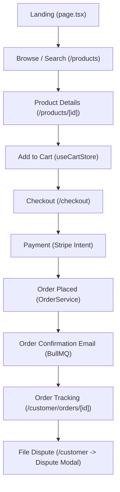
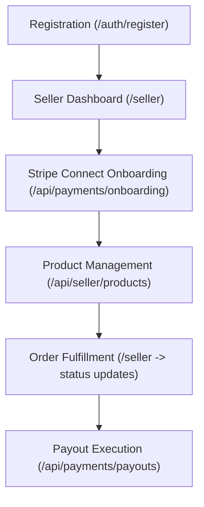
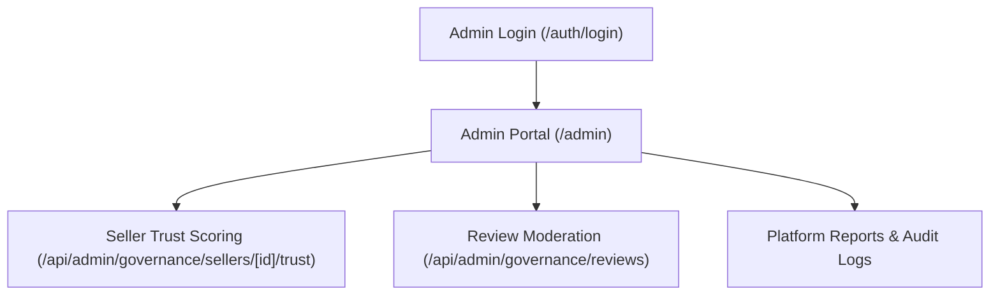

# Sub-Agent 02: Product & Business Flow Report
**Agent Responsibility:** Reverse-engineering existing commercial workflows across Buyer, Seller, and Admin personas.

---

## 1. Buyer / Customer Flow Map

### Flow Verification Status
1. **Landing Page (`/`):** `CONFIRMED`. Renders hero, category cards, featured products, agent trust badges.
2. **Catalog & Search (`/products`):** `CONFIRMED`. Supports text query filtering and category tabs.
3. **Product Details (`/products/[id]` & `/products/slug/[slug]`):** `CONFIRMED`. Displays variants, price, description, rating, JSON-LD metadata.
4. **Cart Management (`useCartStore.ts`):** `CONFIRMED`. In-memory and `localStorage` cart, multi-vendor grouping, item removal, and quantity increments.
5. **Checkout Flow (`/checkout`):** `CONFIRMED`. Step-based checkout with address selection and Stripe Elements integration.
6. **Payment Processing (`PaymentService.ts`):** `CONFIRMED`. Creates Stripe PaymentIntent with automatic escrow breakdown.
7. **Order Creation (`OrderService.ts`):** `CONFIRMED`. Executes in atomic Prisma transaction, decrements variant inventory, records platform fee.
8. **Customer Orders Portal (`/customer` & `/customer/orders/[id]`):** `CONFIRMED`. Lists previous purchases with delivery aggregate status.
9. **Dispute Resolution Flow (`/api/disputes`):** `CONFIRMED`. Buyer can log disputes with evidence URLs; handled via `Dispute` model.

---

## 2. Seller / Vendor Flow Map

### Flow Verification Status
1. **Vendor Registration:** `CONFIRMED`. Role-based registration assigns `seller` role.
2. **Seller Dashboard (`/seller`):** `CONFIRMED`. Layout displays revenue metrics, low-stock warnings, order history.
3. **Stripe Connect Onboarding (`/api/payments/onboarding`):** `CONFIRMED`. Connect account creation, returns Stripe hosted onboarding link.
4. **Product Creation & Stock Management (`/api/seller/products`):** `CONFIRMED`. Allows creating products with variants, options, and status.
5. **Order Fulfillment:** `CONFIRMED`. Seller can update item status (`pending` → `processing` → `shipped` → `delivered`).
6. **Payouts & Transfers (`/api/payments/payouts`):** `PARTIALLY VERIFIED`. Payout routes exist and generate `TransferLog` entries; actual Stripe transfer requires live Stripe Connect test credentials.

---

## 3. Admin / Platform Governance Flow Map

### Flow Verification Status
1. **Admin Route Protection (`middleware.ts`):** `CONFIRMED`. Edge middleware redirects non-admin roles away from `/admin`.
2. **Product Status Moderation (`/api/admin/products/[id]/status`):** `CONFIRMED`. Admins can approve or reject submitted seller products.
3. **Seller Governance Enforcement (`/api/admin/governance/sellers/[id]/enforce`):** `CONFIRMED`. Supports placing stores on probation, updating fraud risk level (`low`, `medium`, `high`, `critical`), or suspending stores.
4. **Customer Review Moderation (`/api/admin/governance/reviews`):** `CONFIRMED`. Moderates pending reviews before public display.
