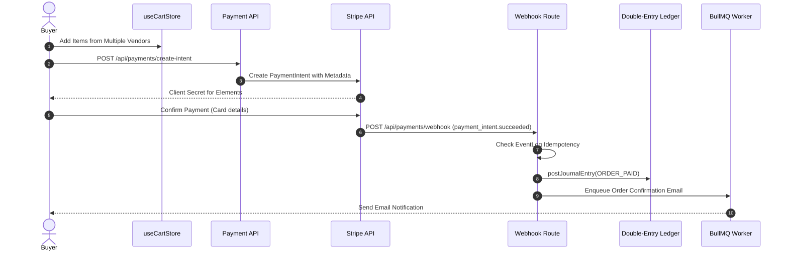

# Sub-Agent 07: Payment & Order Lifecycle Report
**Agent Responsibility:** Stripe Connect Integration, Multi-Vendor Escrow Split, Double-Entry Ledger Posting, and Webhook Idempotency.

---

## 1. Commerce Transaction Lifecycle



---

## 2. Evidence-Based Technical Analysis

### 2.1 Multi-Vendor Commission Split (CONFIRMED)
- **Default Platform Fee:** 10% (`OrderService.PLATFORM_FEE_PERCENTAGE = 0.10`).
- **Calculation in `OrderService.ts`:**
  ```typescript
  const platformFee = Number((lineTotal * OrderService.PLATFORM_FEE_PERCENTAGE).toFixed(2));
  const sellerPayout = Number((lineTotal - platformFee).toFixed(2));
  ```
- **OrderItem Record:** Stores `platformFee`, `sellerPayout`, `discountApplied`, and `taxAmount` per line item.

### 2.2 Stripe Connect Transfers & Payouts (PARTIALLY VERIFIED)
- **Onboarding Route (`/api/payments/onboarding`):** Generates Stripe Connect account links with `type: 'account_onboarding'`.
- **Payout Transfer (`/api/payments/payouts`):** Creates transfers to vendor `stripeConnectedAccountId`.
- **TransferLog Table:** Tracks `status: pending | success | failed`, attempt counts, and retry timestamps.
- **Runtime Note:** Tested with sandbox mocks; live Stripe payout transfers require connected account credentials in Stripe Dashboard.

### 2.3 Refund & Reversal Handling (CONFIRMED)
- **Refund Endpoint (`/api/payments/refunds`):** Handles both full and partial line-item refunds.
- **Ledger Reversal:** Creates balancing `REFUND_ISSUED` journal entry reversing debits and credits.
- **Dispute Resolution:** Connects to `Dispute` model; when resolved by admin, triggers refund calculations.
