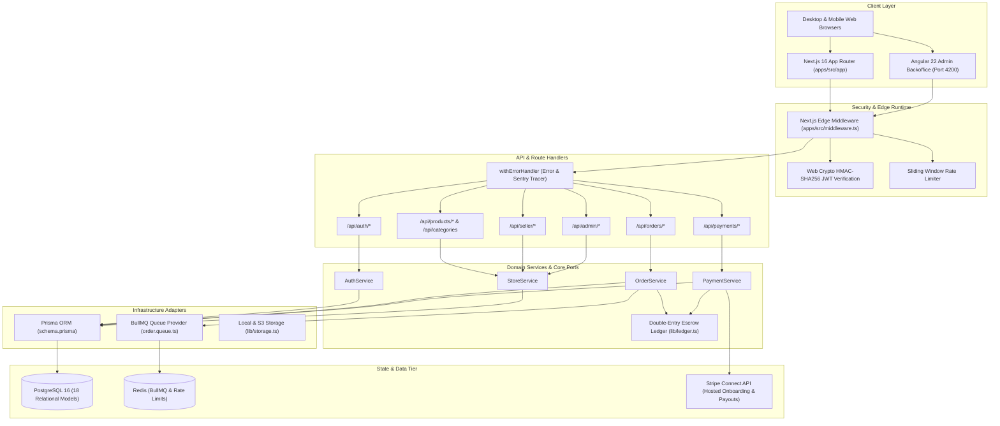

# Master Architecture Map: Multi-Vendor Platform (16-system-architecture.md)
**Agent Responsibility:** End-to-end component interaction mapping, service dependencies, and physical-to-logical architecture.

---

## 1. Complete System Architecture Diagram

---

## 2. Component Responsibility Matrix

| Subsystem | Primary Technologies | File Locations | Primary Role & Invariants |
|---|---|---|---|
| **Frontend App** | Next.js 16.2.9, React 19, Tailwind CSS 4, Zustand 5 | `apps/src/app`, `apps/src/components` | Renders dynamic customer marketplace, seller dashboard, and admin portal. |
| **Admin Client** | Angular 22.1.0, Lucide Angular, Tailwind CSS | `angular-frontend/src/app` | Standalone client designed for backoffice administration and AI concierge. |
| **Security Guard**| Next.js Edge Runtime, Web Crypto API | `apps/src/middleware.ts`, `apps/src/lib/jwt.ts` | Authenticates JWT signatures, enforces RBAC route boundaries, rate-limits abuse. |
| **Domain Logic** | TypeScript, Hexagonal Services | `apps/src/services/*`, `apps/src/core/ports/*`| Enforces business rules, multi-vendor splits, inventory validation, double-entry escrow. |
| **Persistence** | PostgreSQL 16, Prisma 7.9.1 | `apps/prisma/schema.prisma` | Stores relational commerce models with transactional ACID guarantees. |
| **Asynchronous** | BullMQ 5.78, Redis, Nodemailer | `apps/src/lib/queue/*` | Processes transactional order confirmation emails with exponential backoff retries. |
| **Financials** | Stripe API 22.2.1, Double-Entry Ledger | `apps/src/lib/stripe.ts`, `apps/src/lib/ledger.ts` | Generates payment intents, validates webhook signatures, records debits/credits. |
