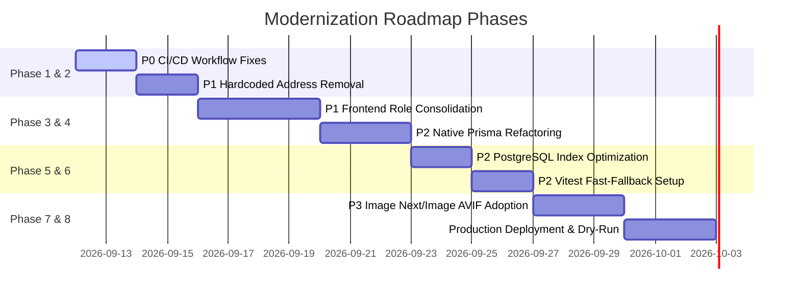

# Modernization & Remediation Roadmap (20-modernization-roadmap.md)
**Agent Responsibility:** Phased, priority-sequenced engineering plan for bringing the platform to 100% production readiness.

---

## 🗺️ Roadmap Overview

---

## 🛠️ Phase-by-Phase Plan

### Phase 1: Critical Stability & CI/CD Hardening (P0)
- Fix `apps/.github/workflows/ci.yml`:
  - Remove reference to missing script `npm run smoke`.
  - Remove or replace non-existent Docker build steps (`frontend/Dockerfile`, `backend/Dockerfile`).
- Fix `apps/.github/workflows/cd.yml`:
  - Remove dead MongoDB commands (`migrate:status`, `migrate:up`, `MONGO_URI`).
  - Replace with `npx prisma migrate deploy` and `DATABASE_URL`.

### Phase 2: Data Integrity & Business Rule Fixes (P1)
- Remove hardcoded shipping address generation in `apps/src/models/Order.ts`.
- Make `shippingAddressId` mandatory in `OrderService.createOrder` with explicit validation.

### Phase 3: Frontend Strategy & Monorepo Clarification (P1)
- Formally clarify role of `angular-frontend/`:
  - Designate Next.js (`apps/`) as the customer & vendor portal.
  - Dedicate Angular (`angular-frontend/`) exclusively to Backoffice Admin or archive if redundant.

### Phase 4: Code Modernization & Native Prisma Transition (P2)
- Deprecate `apps/src/models/prisma-wrap.ts`.
- Replace legacy `_id` calls in `OrderService.ts` and `CatalogRepository` with native Prisma CUID `id` fields.
- Remove `mongodb-memory-server` from `package.json` devDependencies.

### Phase 5: Database Query & Index Optimization (P2)
- Add `@@index([parentId])` to `Category` model in `schema.prisma`.
- Run `npx prisma migrate dev --name add_category_parent_index`.

### Phase 6: Automated Testing & Fast Verification (P2)
- In `apps/test/setup.ts`, check PostgreSQL connection availability with a 2-second probe instead of a 30-second block.
- Execute full Playwright E2E suite against staging environment.

### Phase 7: Production Hardening & Image Delivery (P3)
- Replace static `` tags in product cards with `next/image` using WebP/AVIF format.
- Configure Redis connection pooling for high-concurrency rate limiting.

### Phase 8: Production Verification & Launch
- Execute dry-run deployment on staging.
- Verify end-to-end Stripe Connect webhooks in Stripe sandbox mode.
