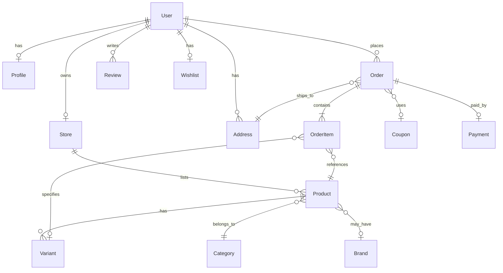

# Schema Design — Nexus Marketplace

> Version: 1.0.0 | Last Updated: 2026-06-14

---

## Entity Relationship Diagram

---

## Entities

### User
**Purpose**: Central identity entity for all platform actors.

| Field | Type | Required | Default | Constraints |
|-------|------|----------|---------|-------------|
| `_id` | ObjectId | Auto | — | Primary key |
| `name` | String | ✅ | — | — |
| `email` | String | ✅ | — | `unique`, `lowercase`, `index` |
| `password` | String | ❌ | — | `select: false` (never returned in queries) |
| `resetPasswordToken` | String | ❌ | — | `select: false` |
| `resetPasswordExpire` | Date | ❌ | — | `select: false` |
| `role` | Enum | ✅ | `'customer'` | `['admin', 'seller', 'customer']` |
| `status` | Enum | ✅ | `'active'` | `['active', 'inactive', 'suspended']` |
| `refreshTokens` | String[] | ❌ | — | `select: false`, SHA-256 hashed |
| `stripeCustomerId` | String | ❌ | — | Stripe Customer ID |
| `createdAt` | Date | Auto | — | Mongoose timestamps |
| `updatedAt` | Date | Auto | — | Mongoose timestamps |

**Indexes**: `email` (unique)

---

### Profile
**Purpose**: Extended user profile metadata.

| Field | Type | Required | Default | Constraints |
|-------|------|----------|---------|-------------|
| `_id` | ObjectId | Auto | — | Primary key |
| `userId` | ObjectId → User | ✅ | — | `index` |
| `phoneNumber` | String | ❌ | — | — |
| `avatar` | String | ❌ | — | URL |
| `bio` | String | ❌ | — | — |

---

### Store
**Purpose**: Seller storefront profile.

| Field | Type | Required | Default | Constraints |
|-------|------|----------|---------|-------------|
| `_id` | ObjectId | Auto | — | Primary key |
| `sellerId` | ObjectId → User | ✅ | — | `unique`, `index` (one store per seller) |
| `storeName` | String | ✅ | — | — |
| `description` | String | ❌ | — | — |
| `logo` | String | ❌ | — | URL |
| `status` | Enum | ✅ | `'pending'` | `['active', 'suspended', 'pending']` |
| `rating` | Number | ✅ | `0` | — |
| `stripeConnectedAccountId` | String | ❌ | — | Stripe Connect account |
| `stripeOnboardingComplete` | Boolean | ✅ | `false` | — |
| `payoutsEnabled` | Boolean | ✅ | `false` | — |

**Ownership Rule**: One User (role=seller) → one Store. Enforced by `unique: true` on `sellerId`.

---

### Product
**Purpose**: Catalog item listed by a seller.

| Field | Type | Required | Default | Constraints |
|-------|------|----------|---------|-------------|
| `_id` | ObjectId | Auto | — | Primary key |
| `sellerId` | ObjectId → User | ✅ | — | `index` |
| `name` | String | ✅ | — | Text indexed |
| `slug` | String | ✅ | — | `unique`, `index` |
| `description` | String | ✅ | — | Text indexed |
| `categoryId` | ObjectId → Category | ✅ | — | `index` |
| `brandId` | ObjectId → Brand | ❌ | — | — |
| `basePrice` | Number | ✅ | — | `min: 0` |
| `images` | String[] | ❌ | — | URLs |
| `status` | Enum | ✅ | `'draft'` | See status lifecycle below |
| `options` | ProductOption[] | ❌ | `[]` | Embedded sub-document |
| `tags` | String[] | ❌ | `[]` | — |
| `rating` | Number | ✅ | `0` | — |
| `numReviews` | Number | ✅ | `0` | — |
| `inStock` | Boolean | ✅ | `true` | `index` |

**Indexes**: `sellerId`, `slug` (unique), `categoryId`, `inStock`, `{ name: 'text', description: 'text' }`

#### Product Status Lifecycle

| Current Status | Allowed Transitions |
|---------------|---------------------|
| `draft` | `pending_review`, `archived` |
| `pending_review` | `approved`, `rejected`, `draft` |
| `approved` | `published`, `archived` |
| `published` | `archived` |
| `rejected` | `draft` |
| `archived` | `draft` |

---

### Variant
**Purpose**: SKU-level product variant with independent pricing and inventory.

| Field | Type | Required | Default | Constraints |
|-------|------|----------|---------|-------------|
| `_id` | ObjectId | Auto | — | Primary key |
| `productId` | ObjectId → Product | ✅ | — | `index` |
| `sellerId` | ObjectId → User | ✅ | — | `index` |
| `sku` | String | ✅ | — | Compound unique with productId |
| `barcode` | String | ❌ | — | — |
| `attributes` | Map<String, String> | ❌ | `{}` | e.g. `{ color: 'red', size: 'M' }` |
| `price` | Number | ✅ | — | `min: 0` |
| `stock` | Number | ✅ | `0` | `min: 0` |
| `lowStockThreshold` | Number | ✅ | `10` | `min: 0` |
| `isActive` | Boolean | ✅ | `true` | — |

**Indexes**: `productId`, `sellerId`, `{ productId: 1, sku: 1 }` (compound unique)

---

### Category
**Purpose**: Product categorization with hierarchical support.

| Field | Type | Required | Default | Constraints |
|-------|------|----------|---------|-------------|
| `_id` | ObjectId | Auto | — | Primary key |
| `name` | String | ✅ | — | — |
| `slug` | String | ✅ | — | `unique`, `index` |
| `parentId` | ObjectId → Category | ❌ | `null` | Self-referencing for hierarchy |
| `image` | String | ❌ | — | URL |

---

### Brand
**Purpose**: Product brand metadata.

| Field | Type | Required | Default | Constraints |
|-------|------|----------|---------|-------------|
| `_id` | ObjectId | Auto | — | Primary key |
| `name` | String | ✅ | — | — |
| `slug` | String | ✅ | — | `unique`, `index` |
| `logo` | String | ❌ | — | URL |

---

### Order
**Purpose**: Customer purchase record spanning multiple sellers.

| Field | Type | Required | Default | Constraints |
|-------|------|----------|---------|-------------|
| `_id` | ObjectId | Auto | — | Primary key |
| `customerId` | ObjectId → User | ✅ | — | `index` |
| `sellerIds` | ObjectId[] → User | ❌ | — | Multi-seller tracking |
| `totalAmount` | Number | ✅ | — | — |
| `aggregateStatus` | Enum | ✅ | `'pending'` | `['pending', 'processing', 'partially_shipped', 'shipped', 'delivered', 'cancelled']` |
| `shippingAddress` | ObjectId → Address | ✅ | — | — |
| `paymentMethod` | Enum | ✅ | — | `['card', 'cod']` |
| `paymentStatus` | Enum | ✅ | `'pending'` | `['pending', 'completed', 'failed', 'refunded']` |
| `stripePaymentIntentId` | String | ❌ | — | — |
| `paidAt` | Date | ❌ | — | Set on payment success |
| `couponId` | ObjectId → Coupon | ❌ | — | — |

**Indexes**: `customerId`

---

### OrderItem
**Purpose**: Per-seller, per-product line item within an order. Contains the financial ledger.

| Field | Type | Required | Default | Constraints |
|-------|------|----------|---------|-------------|
| `_id` | ObjectId | Auto | — | Primary key |
| `orderId` | ObjectId → Order | ✅ | — | `index` |
| `productId` | ObjectId → Product | ✅ | — | — |
| `variantId` | ObjectId → Variant | ❌ | — | — |
| `sellerId` | ObjectId → User | ✅ | — | `index` |
| `quantity` | Number | ✅ | — | `min: 1` |
| `price` | Number | ✅ | — | `min: 0` (snapshot at time of purchase) |
| `status` | Enum | ✅ | `'pending'` | `['pending', 'processing', 'shipped', 'delivered', 'cancelled']` |
| `platformFee` | Number | ✅ | `0` | 10% of line total |
| `sellerPayout` | Number | ✅ | `0` | line total − discount − platform fee |
| `discountApplied` | Number | ✅ | `0` | Pro-rated coupon discount |
| `taxAmount` | Number | ✅ | `0` | Reserved for future tax implementation |

**Indexes**: `orderId`, `sellerId`

**Financial Invariant**: `price × quantity = platformFee + sellerPayout + discountApplied + taxAmount`

---

### Payment
**Purpose**: Stripe payment record linked to an order.

| Field | Type | Required | Default | Constraints |
|-------|------|----------|---------|-------------|
| `_id` | ObjectId | Auto | — | Primary key |
| `orderId` | ObjectId → Order | ✅ | — | `index` |
| `stripePaymentIntentId` | String | ✅ | — | `unique` |
| `stripeChargeId` | String | ❌ | — | — |
| `amount` | Number | ✅ | — | In dollars (converted from cents) |
| `currency` | String | ✅ | `'usd'` | — |
| `provider` | Enum | ✅ | — | `['stripe', 'cod']` |
| `status` | Enum | ✅ | `'pending'` | `['pending', 'completed', 'failed', 'refunded']` |
| `metadata` | Mixed | ❌ | — | Full Stripe PaymentIntent object |

---

### Coupon
**Purpose**: Discount codes (global or seller-scoped).

| Field | Type | Required | Default | Constraints |
|-------|------|----------|---------|-------------|
| `_id` | ObjectId | Auto | — | Primary key |
| `code` | String | ✅ | — | `unique`, `uppercase` |
| `discountType` | Enum | ✅ | — | `['percentage', 'fixed']` |
| `value` | Number | ✅ | — | Percentage (0–100) or fixed dollar amount |
| `minOrderValue` | Number | ❌ | `0` | Minimum eligible subtotal |
| `maxDiscount` | Number | ❌ | — | Cap on discount amount |
| `validFrom` | Date | ✅ | — | — |
| `validTo` | Date | ✅ | — | — |
| `usageLimit` | Number | ✅ | `1` | — |
| `usedCount` | Number | ✅ | `0` | Incremented within order transaction |
| `scope` | Enum | ✅ | `'global'` | `['global', 'seller']` |
| `sellerId` | ObjectId → User | ❌ | — | Required when scope = 'seller' |

---

### Address
**Purpose**: Shipping and billing addresses for users.

| Field | Type | Required | Default | Constraints |
|-------|------|----------|---------|-------------|
| `_id` | ObjectId | Auto | — | Primary key |
| `userId` | ObjectId → User | ✅ | — | `index` |
| `type` | Enum | ✅ | — | `['billing', 'shipping']` |
| `street` | String | ✅ | — | — |
| `city` | String | ✅ | — | — |
| `state` | String | ✅ | — | — |
| `zip` | String | ✅ | — | — |
| `country` | String | ✅ | — | — |
| `isDefault` | Boolean | ✅ | `false` | — |

---

### Review
**Purpose**: Customer product reviews.

| Field | Type | Required | Default | Constraints |
|-------|------|----------|---------|-------------|
| `_id` | ObjectId | Auto | — | Primary key |
| `productId` | ObjectId → Product | ✅ | — | `index` |
| `customerId` | ObjectId → User | ✅ | — | — |
| `rating` | Number | ✅ | — | `min: 1, max: 5` |
| `comment` | String | ✅ | — | — |
| `images` | String[] | ❌ | — | URLs |

---

### Wishlist
**Purpose**: Customer product wishlist.

| Field | Type | Required | Default | Constraints |
|-------|------|----------|---------|-------------|
| `_id` | ObjectId | Auto | — | Primary key |
| `customerId` | ObjectId → User | ✅ | — | `unique`, `index` (one per customer) |
| `productIds` | ObjectId[] → Product | ❌ | — | — |

---

## Database Constraints Summary

| Constraint | Entity | Fields |
|-----------|--------|--------|
| Unique email | User | `email` |
| Unique slug | Product, Category, Brand | `slug` |
| Unique SKU per product | Variant | `{ productId, sku }` |
| One store per seller | Store | `sellerId` (unique) |
| One wishlist per customer | Wishlist | `customerId` (unique) |
| Unique coupon code | Coupon | `code` |
| Unique payment intent | Payment | `stripePaymentIntentId` |
| Min price | Product, Variant | `basePrice/price ≥ 0` |
| Min quantity | OrderItem | `quantity ≥ 1` |
| Rating bounds | Review | `1 ≤ rating ≤ 5` |
| Stock non-negative | Variant | `stock ≥ 0` |

---

> **Cross-references**: [techspec.md](techspec.md) (architecture), [DATABASE_DESIGN.md](DATABASE_DESIGN.md) (deep dive)
