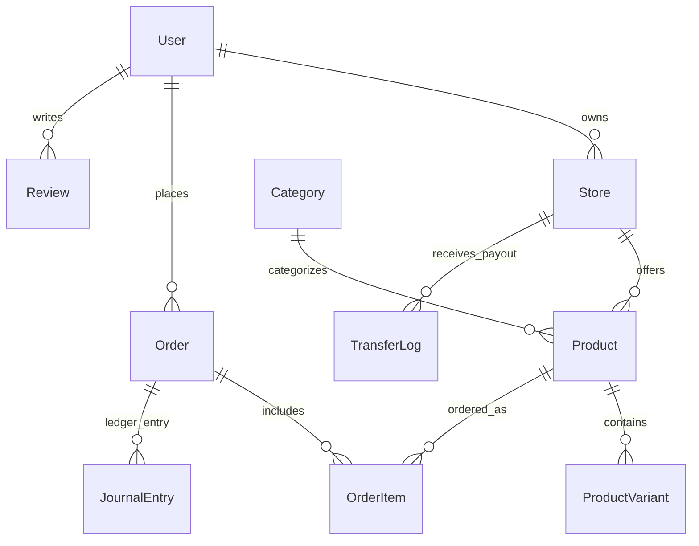

# 05 — Backend Database Schema & Data Models

> **Document ID:** DOC-05-BACKEND-SCHEMA  
> **Platform:** Nexus Multi-Vendor E-Commerce Marketplace  
> **Database:** PostgreSQL 16 via Prisma ORM 7.9.1 (`prisma/schema.prisma`)  
> **Status:** Canonical & Active  
> **Last Updated:** 2026-09-30  
> **Author:** Lead Database Architect  

---

## 1. Relational Database Overview

Nexus utilizes **PostgreSQL 16** managed via **Prisma ORM**. The data model enforces strong relational integrity, foreign key constraints, composite unique indexes, enum type safety, audit timestamps, and soft-deletes.



---

## 2. Core Enums

```prisma
enum Role {
  admin
  seller
  customer
}

enum ProductStatus {
  draft
  pending_review
  approved
  published
  rejected
  archived
}

enum OrderAggregateStatus {
  pending
  processing
  partially_shipped
  shipped
  delivered
  cancelled
}

enum OrderItemStatus {
  pending
  processing
  shipped
  delivered
  cancelled
}

enum PaymentStatus {
  pending
  completed
  failed
  refunded
}
```

---

## 3. Entity & Table Specifications

### 3.1 `User` (Authentication & Profile)

| Column | Type | Constraints / Attributes | Description |
| :--- | :--- | :--- | :--- |
| `id` | `String` | `@id @default(cuid())` | Unique Primary Key |
| `name` | `String` | Not Null | Display name |
| `email` | `String` | `@unique`, Not Null | Login email address |
| `password` | `String` | Not Null | Bcrypt hashed password (12 rounds) |
| `role` | `Role` | `@default(customer)` | RBAC role |
| `status` | `UserStatus` | `@default(active)` | Account health |
| `refreshTokens`| `String[]` | `@default([])` | SHA-256 hashed refresh tokens |
| `createdAt` | `DateTime` | `@default(now())` | Record creation timestamp |
| `updatedAt` | `DateTime` | `@updatedAt` | Last modification timestamp |

### 3.2 `Store` (Multi-Vendor Tenant)

| Column | Type | Constraints / Attributes | Description |
| :--- | :--- | :--- | :--- |
| `id` | `String` | `@id @default(cuid())` | Unique Primary Key |
| `name` | `String` | Not Null | Merchant store title |
| `slug` | `String` | `@unique`, Not Null | SEO-friendly URL handle |
| `description` | `String?` | Optional | Store story / bio |
| `logo` | `String?` | Optional | Brand asset URL |
| `stripeAccountId` | `String?` | `@unique` | Connected Stripe Express Account ID |
| `stripeOnboardingComplete` | `Boolean` | `@default(false)` | Verified payout capability |
| `userId` | `String` | `@unique`, FK → `User.id` | Vendor owner account |
| `deletedAt` | `DateTime?`| Soft-delete flag | Historical record preservation |

### 3.3 `Product` & `ProductVariant` (Catalog)

```prisma
model Product {
  id             String         @id @default(cuid())
  name           String
  slug           String         @unique
  description    String?        @db.Text
  basePrice      Float          // In USD decimal (canonicalized to integer cents in API)
  images         String[]
  status         ProductStatus  @default(draft)
  rejectionReason String?
  storeId        String
  store          Store          @relation(fields: [storeId], references: [id])
  categoryId     String
  category       Category       @relation(fields: [categoryId], references: [id])
  variants       ProductVariant[]
  reviews        Review[]
  orderItems     OrderItem[]
  deletedAt      DateTime?      // Soft-deletion invariant
  createdAt      DateTime       @default(now())
  updatedAt      DateTime       @updatedAt

  @@index([storeId])
  @@index([categoryId])
  @@index([status])
}

model ProductVariant {
  id         String   @id @default(cuid())
  sku        String   @unique
  title      String
  price      Float
  stock      Int      @default(0) // Inventory counter
  options    Json?    // Specific attributes (e.g. { "size": "M", "color": "Navy" })
  productId  String
  product    Product  @relation(fields: [productId], references: [id], onDelete: Cascade)
  createdAt  DateTime @default(now())
  updatedAt  DateTime @updatedAt

  @@index([productId])
}
```

### 3.4 `Order` & `OrderItem` (Transactions & Multi-Vendor Splits)

```prisma
model Order {
  id                   String               @id @default(cuid())
  userId               String
  user                 User                 @relation(fields: [userId], references: [id])
  totalAmount          Float                // Total order charge in USD
  paymentMethod        PaymentMethod        @default(card)
  paymentStatus        PaymentStatus        @default(pending)
  aggregateStatus      OrderAggregateStatus @default(pending)
  stripePaymentIntentId String?             @unique
  shippingAddressId    String
  shippingAddress      Address              @relation(fields: [shippingAddressId], references: [id])
  items                OrderItem[]
  journalEntries       JournalEntry[]
  deletedAt            DateTime?
  createdAt            DateTime             @default(now())
  updatedAt            DateTime             @updatedAt

  @@index([userId])
  @@index([paymentStatus])
  @@index([aggregateStatus])
}

model OrderItem {
  id           String          @id @default(cuid())
  orderId      String
  order        Order           @relation(fields: [orderId], references: [id], onDelete: Cascade)
  productId    String
  product      Product         @relation(fields: [productId], references: [id])
  variantId    String?
  sellerId     String
  seller       Store           @relation(fields: [sellerId], references: [id])
  quantity     Int
  price        Float           // Item unit purchase price
  platformFee  Float           // 10% platform take-rate
  sellerPayout Float           // 90% net payout to vendor
  status       OrderItemStatus @default(pending)
  createdAt    DateTime        @default(now())
  updatedAt    DateTime        @updatedAt

  @@index([orderId])
  @@index([sellerId])
}
```

### 3.5 `JournalEntry` & `LedgerAccount` (Double-Entry Escrow Ledger)

```prisma
model JournalEntry {
  id          String           @id @default(cuid())
  orderId     String?
  order       Order?           @relation(fields: [orderId], references: [id])
  eventName   JournalEventName
  status      JournalStatus    @default(POSTED)
  description String
  lines       JournalLine[]
  createdAt   DateTime         @default(now())
}

model JournalLine {
  id             String               @id @default(cuid())
  journalEntryId String
  journalEntry   JournalEntry         @relation(fields: [journalEntryId], references: [id], onDelete: Cascade)
  accountId      String
  account        LedgerAccount        @relation(fields: [accountId], references: [id])
  direction      TransactionDirection // DEBIT or CREDIT
  amount         Float
}
```

---

## 4. Invariants, Indexing & Migration Rules

1. **Composite & Foreign Indexes:** Every foreign key (`storeId`, `categoryId`, `orderId`, `sellerId`) is explicitly indexed with `@@index` to prevent full-table sequential scans during joins.
2. **Soft Deletions:** Deletion queries must update `deletedAt: new Date()` instead of issuing `DELETE` statements.
3. **Migration Discipline:**
   - Any schema changes must be generated via `npm run db:migrate` with a descriptive name.
   - Dropping columns or renaming columns must follow the **Expand/Contract** two-phase deployment pattern to ensure zero downtime.
