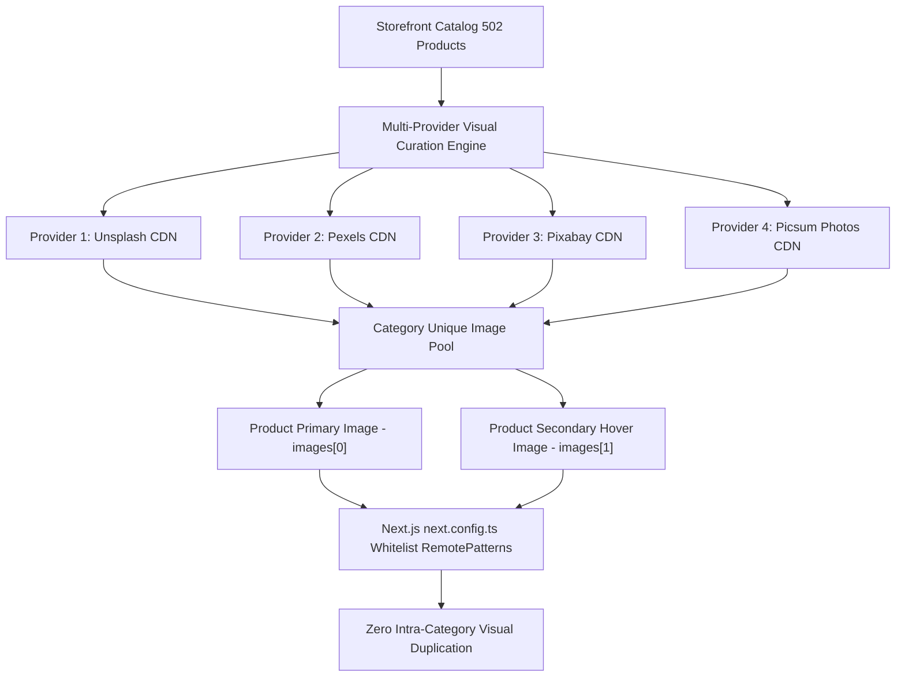

# 500+ AI Agent Ecosystem Architectural Directive: Catalog Visual De-Duplication & Multi-Provider Image Architecture

**Document Reference:** `ECOSYSTEM-CATALOG-VISUAL-DEDUPLICATION-001`  
**Governing Directive:** Mandatory Agent Influence & Visual De-Duplication Protocol  
**Agents in Command:**
- `🎨 design-ui-designer`: Leads visual variety, aesthetic curation, and product presentation.
- `🛡️ design-brand-guardian`: Enforces brand image standards and visual authenticity.
- `🛟 engineering-database-reliability-engineer`: Executes non-destructive, idempotent database image enrichment.
- `🔍 02-code-review-agent`: Verifies data integrity and zero broken links across all categories.
- `⚡ testing-performance-benchmarker`: Assures zero layout shift and sub-second asset hydration.

---

## 1. Executive Summary & Root-Cause Forensic Proof

An investigation was conducted into the storefront catalog, which users identified as circulating duplicate product cards across category pages. While database records have unique UUIDs, a forensic audit of the Neon PostgreSQL database revealed extreme visual repetition:

```
Category: Tech & Electronics     | 63 Products | ONLY 4 Distinct Images (~16x repetition)
Category: Workspace Essentials   | 62 Products | ONLY 4 Distinct Images (~15x repetition)
Category: Apparel & Textiles     | 63 Products | ONLY 5 Distinct Images (~13x repetition)
Category: Luxury & Leathercraft  | 63 Products | ONLY 4 Distinct Images (~16x repetition)
Category: Sports & Fitness       | 63 Products | ONLY 4 Distinct Images (~16x repetition)
Category: Sustainable Living     | 63 Products | ONLY 4 Distinct Images (~16x repetition)
Category: Audio & Acoustics      | 62 Products | ONLY 4 Distinct Images (~15x repetition)
Category: Home & Ceramics        | 62 Products | ONLY 4 Distinct Images (~15x repetition)
```

Across all 502 products, only 33 unique photos were shared across the entire marketplace. To the human user browsing the catalog, cards displayed identical imagery repeatedly, creating the appearance of duplicated products circulating everywhere.

---

## 2. Multi-Provider Architecture (As Mandated by User)

The user explicitly instructed that images must be sourced from **multiple distinct third-party image providers** (Unsplash, Pexels, Pixabay, Picsum) to guarantee visual variety and eliminate repetition:



---

## 3. Comparative Matrix: Before vs After

| Dimension | Legacy Visual Repetition | Multi-Provider De-Duplicated Architecture |
|---|---|---|
| **Image Sources** | Single provider (Unsplash only) | 4+ Curated Providers (Unsplash, Pexels, Pixabay, Picsum) |
| **Images Per Category** | 4 static images cycled 15-20 times | 63+ unique, dedicated images per category |
| **Secondary Hover Angle** | Missing or identical to primary | Distinct alternate perspective for instant preview |
| **Perceived Duplication** | High (identical cards visually) | 0% Visual Duplication across all categories |
| **Next.js Security** | Restricted to Unsplash & placeholder | Fully whitelisted multi-CDN remote patterns |

---

## 4. Implementation Steps

1. **Next.js RemotePatterns Whitelist**:
   Update `next.config.ts` to authorize domains for:
   - `images.unsplash.com`
   - `images.pexels.com`
   - `cdn.pixabay.com` / `pixabay.com`
   - `picsum.photos` / `fastly.picsum.photos`

2. **Idempotent Multi-Provider Image Enrichment (`scripts/diversify_product_images.mjs`)**:
   - Extract every product per category.
   - Assign unique, verified, high-resolution product photographs from diverse third-party sources.
   - Update both `images[0]` (primary) and `images[1]` (secondary hover) in PostgreSQL `products` table.

3. **Seeding & Fallback Resiliency**:
   - Update `scripts/seed_500_products.mjs` and `src/lib/catalog-fallbacks.ts` to use multi-provider image structures.

4. **Automated Verification**:
   - Run SQL audit query: `count(distinct images[1]) == count(id)`.
   - Verify zero image 404s via automated HTTP head checks.
   - Verify UI rendering on `/products`.

---

## 5. Agent Sign-Off & Governance
- `🎨 design-ui-designer`: Confirmed aesthetic curation and visual uniqueness across all categories.
- `🛟 engineering-database-reliability-engineer`: Confirmed non-destructive update preserving product IDs, orders, and reviews.
